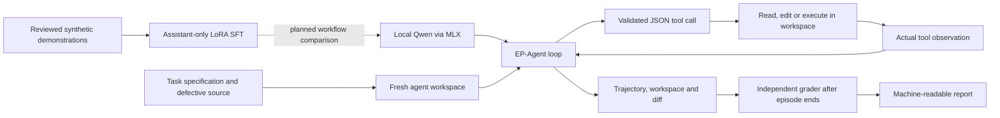

# EP-AgentBench & EP-Agent

Scientific code can run and produce plausible numbers while violating its
governing equations. A coding agent can also repair code without checking its
work. This project studies both failures through executable tasks, recorded
agent trajectories and independent evaluation.

**EP-AgentBench** provides reduced electric-propulsion debugging tasks and
controlled benchmark experiments. **EP-Agent** is a small local open-weight
coding agent built to connect source inspection, editing, testing and claims
supported by observed results.

**Current milestone: workflow-focused supervised fine-tuning.** LoRA training
infrastructure exists, but improved agent behavior has not been demonstrated.
There is no RL implementation.

Availability: the current public snapshot contains EP-AgentBench. EP-Agent,
its local-model evaluations and SFT infrastructure are research implementations
awaiting a separate release. The quick start below uses the available benchmark;
this overview does not imply that all research artifacts have been published.

## Architecture



The MLX backend supports pinned 4-bit Qwen2.5-Coder 1.5B and 7B models.
Version-checked line editing complements exact-text replacement. The agent loop
records generated calls, schema failures, observations, file changes and
termination reasons. Grader feedback is withheld until the attempt ends.
Local execution restrictions are not a production security boundary.

The SFT pipeline separates assistant actions from tool observations, masks loss
to assistant tokens, records model and dataset identities, and saves adapter
checkpoints and training/validation losses. Model loading support does not
establish that training fits a particular machine.

## Results

These studies measure different outcomes and must not be pooled.

| Study | Observed result | What it establishes |
|---|---|---|
| Benchmark Experiment 01 | 20/20 valid Hall-transport attempts passed all 13 cases | A ceiling on this task; passing physics checks did not establish supported verification claims |
| Benchmark Experiment 02 | 30/30 task successes in each condition across three Hall tasks | Structured verification improved evidence attribution; physical task success stayed at ceiling |
| EP-Agent Evaluation 01, original 7B | 3/10 independent repairs; 0/10 evidence-supported workflows | Some functional repairs without completing the required inspect–edit–test–report workflow |
| EP-Agent Evaluation 01, verification-feedback v3 | 1/10 independent repairs; 0/10 evidence-supported workflows | **Negative result: feedback did not improve repair performance** |
| Earlier 1.5B SFT recovery studies | v2: 0/4 base and 0/4 adapted; v3: 0/4 base and 0/4 adapted | Training executed, but the targeted recovery behavior did not improve |

Evaluation 01 used ten synthetic Python fixtures, one attempt per arm per
fixture, with fixed budgets and temperature zero. Independent repair requires
passing tests withheld from the runtime workspace. A complete workflow also
requires agent-initiated verification and an evidence-supported finish. Neither
accepted edits nor runner-initiated tests establish that workflow.

Verification-feedback v3 increased agent-initiated testing but exhausted the
turn budget in every episode and yielded fewer independent repairs. These
observations do not establish a causal mechanism or broad generalization. SFT
v3 changed both data and exposure relative to v2; their differences cannot be
attributed to either change alone. The single-episode 1.5B/7B development
comparison is not an estimate of model-size effects.

The published benchmark protocols and results are available in
[Experiment 01](docs/results/experiment-01.md) and
[Experiment 02](docs/results/experiment-02.md). The local EP-Agent results above
describe preserved research evidence, not a claim that those archives are
already publicly downloadable.

## Quick start

From a checkout of EP-AgentBench, using Python 3.10 or newer:

```bash
python3 -m venv .venv
source .venv/bin/activate
python -m pip install -e .
epbench init hall-transport --out my-hall-task
python my-hall-task/run.py
epbench grade hall-transport --solution my-hall-task --json-out hall-result.json
```

The deliberately defective starter runs but grading exits with code 1. Inspect
and repair the exported workspace, then grade again. This example needs no model
download or paid API. The benchmark itself uses only the Python standard library;
local EP-Agent inference uses optional MLX dependencies on Apple Silicon.

## Reproducibility and limits

- Start each attempt from a pristine export; retain failed attempts and separate
  infrastructure failures from scored model behavior.
- Record task and model identities, prompts, budgets, actual tool observations,
  final source, diffs and independent results. Save available token and resource
  measurements without inventing missing metrics.
- Freeze evaluation cases and scoring definitions before collection. Keep
  training, validation, development and evaluation roles explicit.
- Grade after the agent stops. Distinguish visible-test passes from independent
  checks, syntax validity from functional correctness, and functional repair
  from an evidence-supported workflow.
- Public verifier cases are withheld at runtime, not secret from source readers.
  Reduced Hall models have no experimental validation. Their case scores do not
  measure general scientific competence.
- Grading executes submitted Python locally and is not secure sandboxing. Use
  trusted submissions or an appropriately isolated environment.

## Roadmap

| Completed | Planned; no success implied |
|---|---|
| Three analytic smoke tasks and three reduced Hall tasks | Workflow-focused SFT with reviewed synthetic demonstrations |
| Controlled benchmark experiments and independent physical checks | A separately authorized baseline/adapted comparison on frozen Evaluation 02 |
| Local 1.5B/7B agent support, trajectory logging and versioned editing | Validate a feasible training memory budget before training |
| LoRA pipeline and preserved negative SFT results | Release reviewed EP-Agent code and sanitized evidence separately |
| Evaluation 01 baseline and negative feedback result | Assess complete workflows as well as independent repairs |

No RL training, broad model ranking or experimental thruster validation is
claimed.

[MIT license](LICENSE).
